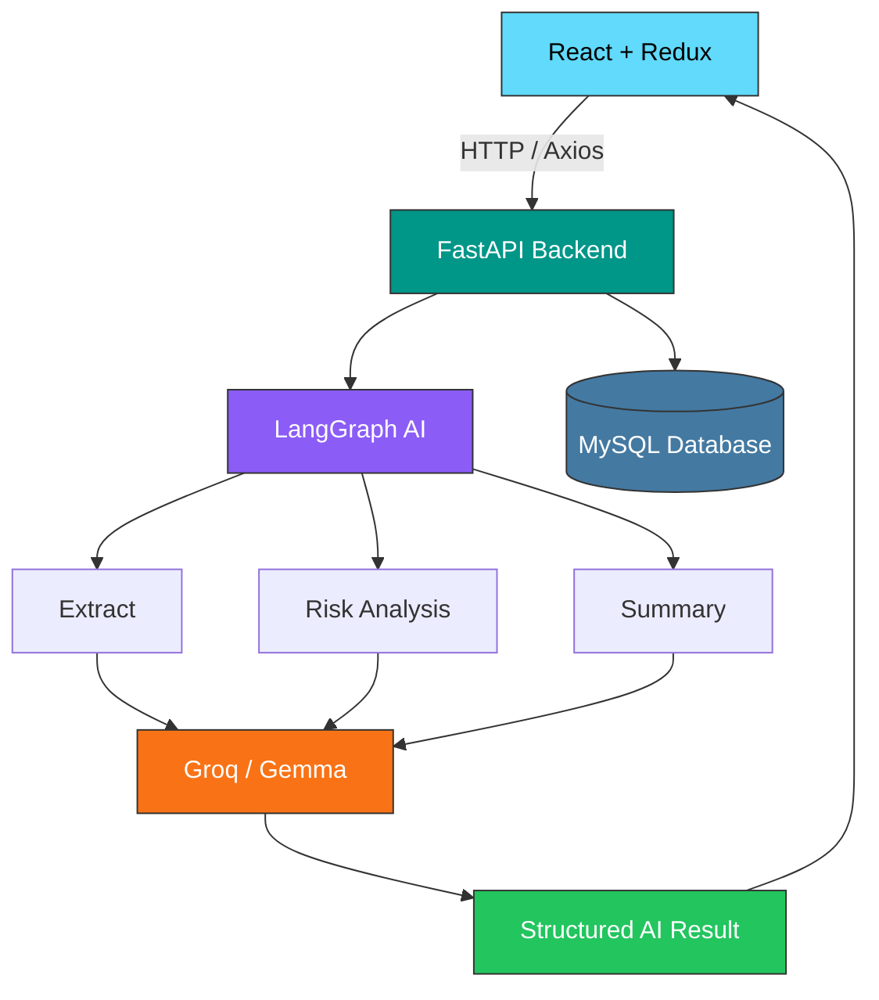

# AI-powered-customer-complaint-management-system

AI-Powered Customer Complaint Management System is a web-based application designed for managing pharmaceutical customer complaints. It uses React and Redux for the frontend, FastAPI for backend APIs, LangGraph and Groq LLMs for complaint extraction, completeness checking, risk assessment, and summarization, and MySQL for storing complaint records. Users can upload or enter complaint information, receive AI-assisted analysis, review the extracted details and risk assessment, and save the complaint for future tracking.

## Architecture



## Main Components

### Frontend
- **React** – complaint form, file upload, AI assistant, and results UI.
- **Redux Toolkit** – manages complaint form state, AI results, loading/error states, and save status.
- **Axios** – communicates with FastAPI.

### Backend
- **FastAPI** – exposes REST APIs for complaint analysis and CRUD operations.
- **LangGraph** – orchestrates the multi-step AI workflow.
- **Groq / Gemma 2 9B** – performs complaint extraction, risk assessment, and summarization.
- **SQLAlchemy** – database ORM.
- **MySQL** – persists complaints and related information.
- **Rule-based fallback** – existing deterministic extraction logic in `complaint.py` is used when needed.

## Workflow

1. User enters complaint text or uploads a PDF/DOCX/TXT/EML file.
2. React sends the input to FastAPI.
3. FastAPI extracts document text when required.
4. LangGraph starts the complaint workflow.
5. The LLM extracts structured complaint fields.
6. The workflow checks complaint completeness.
7. The LLM generates an AI-assisted risk assessment.
8. The workflow generates a concise complaint summary.
9. FastAPI returns the structured result.
10. Redux updates the complaint form and AI Copilot panel.
11. After user review, the complaint is saved to MySQL.
12. Saved complaints can be retrieved through the complaint history APIs.


## Core API Endpoints

GET     /health
GET     /api/complaints
GET     /api/complaints/{id}
POST    /api/complaints/analyze-text
POST    /api/complaints/analyze-file
POST    /api/complaints
PUT     /api/complaints/{id}
DELETE  /api/complaints/{id}

## Backend Installation

From the `backend` directory:

### 1. Create a virtual environment

Windows:

```powershell
python -m venv venv
venv\Scripts\activate
```

### 2. Install dependencies

```powershell
python -m pip install -r requirements.txt
```

If `requirements.txt` has not yet been created, install the main packages:

```powershell
python -m pip install fastapi uvicorn sqlalchemy pymysql pydantic python-dotenv langgraph groq python-multipart pypdf
```

### 3. Start the backend

```powershell
python -m uvicorn app1.main:app --reload
```

Backend URL:

```text
http://127.0.0.1:8000
```

Swagger API documentation:

```text
http://127.0.0.1:8000/docs
```

Health check:

```text
http://127.0.0.1:8000/health
```

## Frontend Installation

From the `frontend` directory:

### 1. Install dependencies

```powershell
npm install
```

If required:

```powershell
npm install @reduxjs/toolkit react-redux axios lucide-react
```

### 2. Start the frontend

```powershell
npm run dev
```

The frontend normally runs at:

```text
http://localhost:5173
```

## Running the Complete Application

Use two terminals.

### Terminal 1 – Backend

```powershell
cd C:\Users\91934\AIVOA\backend
venv\Scripts\activate
python -m uvicorn app1.main:app --reload
```

### Terminal 2 – Frontend

```powershell
cd C:\Users\91934\AIVOA\frontend
npm run dev
```

Then open:

```text
http://localhost:5173
```

## API Testing

### Health check

```http
GET /health
```

Expected response:

```json
{
  "status": "ok"
}
```

### Save a complaint

```http
POST /api/complaints
```

Example:

```json
{
  "complaintSource": "Customer Email",
  "customerName": "ABC Pharma",
  "productName": "Paracetamol Tablets",
  "productStrength": "500 mg",
  "batchNumber": "B1234",
  "manufacturingDate": "2026-08-10",
  "expiryDate": "2028-08-09",
  "quantityAffected": "20 cartons",
  "complaintType": "Packaging",
  "complaintDate": "2026-09-18",
  "description": "Customer reported damaged outer packaging on several cartons.",
  "initialSeverity": "Medium",
  "priority": "Normal"
}
```

### Analyze complaint text

```http
POST /api/complaints/analyze-text
```

Example:

```json
{
  "text": "ABC Pharma reported damaged outer packaging for Paracetamol 500 mg tablets from batch B1234. The complaint was received on 18 September 2026. Approximately 20 cartons were affected."
}
```

### Analyze complaint file

```http
POST /api/complaints/analyze-file
```

Supported prototype input formats:

- PDF
- DOCX
- TXT
- EML

Maximum file size configured by the backend: 10 MB.

## AI Risk Assessment

The AI risk assessment is intended as an **AI-assisted triage feature** rather than an autonomous quality decision.

The risk workflow can evaluate:

- Complaint type
- Severity indicators
- Product-quality concerns
- Safety-related language
- Batch information
- Complaint completeness
- Potential customer impact

The result can contain:

```json
{
  "risk_level": "High",
  "risk_reason": "Potential product-quality concern associated with a specific batch.",
  "key_risks": [
    "Batch-specific issue",
    "Potential product-quality impact"
  ],
  "recommended_action": "Initiate QA review and investigate the affected batch."
}
```

